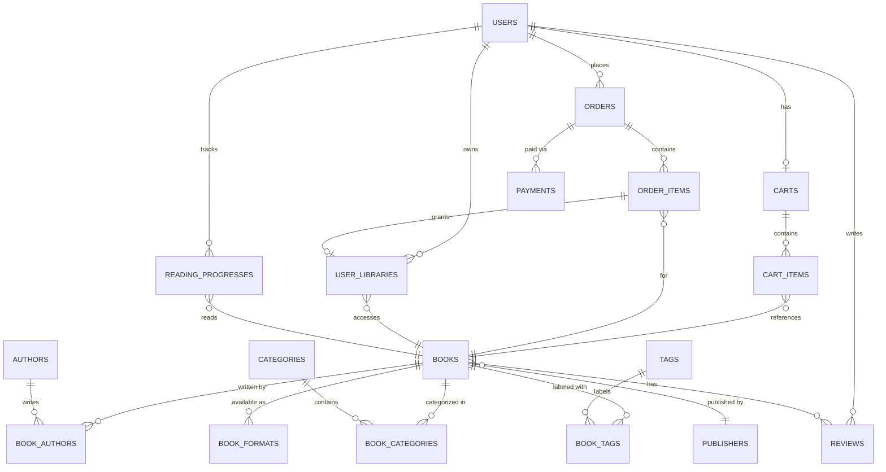

<![CDATA[<p align="center">
  
</p>

<h1 align="center">Ebook Reader</h1>

<p align="center">
  <b>A complete digital bookstore & reading platform — from browsing to checkout to reading.</b>
</p>

<p align="center">
  <a href="#-what-can-it-do"><strong>Features</strong></a> ·
  <a href="#-how-it-works"><strong>How it Works</strong></a> ·
  <a href="#-architecture"><strong>Architecture</strong></a> ·
  <a href="#-getting-started"><strong>Getting Started</strong></a> ·
  <a href="#-api-reference"><strong>API Docs</strong></a>
</p>

<p align="center">
  
  
  
  
  
</p>

---

## 💡 Why Ebook Reader?

The digital book market is booming — but building a full e-commerce + reading platform from scratch is complex. You need user authentication, a book catalog, a shopping cart, payment processing, digital rights management, and reading progress tracking — all working together seamlessly.

**Ebook Reader** solves this by providing a **production-ready backend API** that handles the entire user journey: from discovering a book, to purchasing it, to reading it — all through clean, well-documented REST APIs.

> Think of it as the **backend engine** for platforms like Google Play Books or Amazon Kindle — handling everything behind the scenes so the frontend can focus on delivering a great reading experience.

---

## ✨ What Can It Do?

### 📚 Book Catalog & Discovery

Manage a rich catalog of ebooks with authors, publishers, categories, and tags. Support advanced filtering and search so readers can find exactly what they're looking for.

- Browse books by category, author, publisher, or tag
- Multi-format support per book (EPUB, PDF, MOBI)
- Book badges (New, Bestseller, etc.) based on sales & ratings
- Detailed book pages with descriptions, covers, and metadata

### 🔐 User Accounts & Security

Secure, stateless authentication system that keeps user data safe while providing a smooth login experience.

- Sign up, sign in, and sign out with email & password
- JWT-based authentication delivered via secure HTTP-only cookies
- Role-based access control — separate **User** and **Admin** privileges
- Password reset via email with secure, time-limited tokens
- Automatic token refresh — users stay logged in seamlessly

### 🛒 Shopping Cart & Checkout

A familiar e-commerce experience — add books to a cart, proceed to checkout, and create an order.

- Add/remove books to a personal shopping cart
- One-click checkout that converts the cart into an order
- Price snapshots at order time (prices are locked in when you buy)
- Automatic order expiration — unpaid orders expire after 15 minutes

### 💳 Payment Processing

Integrated with **real Vietnamese payment gateways** so users can pay with the methods they already use.

| Provider | Status | Description |
|---|---|---|
| **VNPay** | ✅ Integrated | Vietnam's leading payment gateway |
| **MoMo** | ✅ Integrated | Popular Vietnamese e-wallet |
| **Stripe** | 🔧 Planned | International card payments |

- Secure webhook handling (IPN) for asynchronous payment confirmation
- **Idempotent processing** — duplicate payment notifications are safely ignored
- Automatic redirect back to the frontend after payment

### 📖 Digital Library & Reading

After purchase, books appear in the user's **personal library** — ready to read on any device.

- Personal library showing all purchased books
- Favorite books for quick access
- Access control — revoke access for refunded orders
- **Reading progress tracking** — save position, percentage, and status
- Sync reading position across devices

### ⭐ Reviews & Ratings

Let readers share their opinions and help others discover great books.

- 1–5 star rating system with text reviews
- "Helpful" voting on reviews
- Aggregate statistics (average rating, rating distribution)
- Verified purchase enforcement — only buyers can review

### 📁 File & Media Management

Secure file handling for book covers, author avatars, and ebook files using cloud object storage.

- Pre-signed URL uploads — files go directly to cloud storage (never through the API server)
- Support for public assets (covers) and private assets (ebook files)
- Automatic cleanup of orphaned files via background processing

### 📧 Email Notifications

Transactional email system for critical user communications.

- Password reset emails with branded HTML templates
- Reliable delivery via **Outbox Pattern** — emails are never lost, even if the mail server is temporarily down
- Automatic retry with exponential backoff

---

## 🔄 How It Works

Here's the typical user journey through the platform:

```
  ┌─────────────────────────────────────────────────────────────────────┐
  │                        USER JOURNEY                                 │
  ├─────────────────────────────────────────────────────────────────────┤
  │                                                                     │
  │  1. DISCOVER        2. SHOP            3. PAY           4. READ    │
  │  ┌──────────┐      ┌──────────┐      ┌──────────┐    ┌──────────┐ │
  │  │ Browse   │ ───▶ │ Add to   │ ───▶ │ Checkout │──▶ │ Open in  │ │
  │  │ Catalog  │      │ Cart     │      │ & Pay    │    │ Reader   │ │
  │  └──────────┘      └──────────┘      └──────────┘    └──────────┘ │
  │       │                                    │               │       │
  │       ▼                                    ▼               ▼       │
  │  Filter by          Price locked      VNPay / MoMo     Progress   │
  │  category,          at checkout       payment flow     synced     │
  │  author, tag                                           across     │
  │                                                        devices    │
  │                                                                    │
  │  ┌──────────────────────────────────────────────────────────────┐  │
  │  │                    BEHIND THE SCENES                         │  │
  │  ├──────────────────────────────────────────────────────────────┤  │
  │  │  • JWT auth cookies keep sessions secure & stateless        │  │
  │  │  • Outbox pattern ensures emails & file cleanup never fail  │  │
  │  │  • Idempotent webhooks prevent duplicate payments           │  │
  │  │  • Background jobs auto-expire unpaid orders (15 min)       │  │
  │  └──────────────────────────────────────────────────────────────┘  │
  └─────────────────────────────────────────────────────────────────────┘
```

---

## 🏗 Architecture

### System Overview

The backend follows a **layered architecture** with clear separation of concerns. Each feature is organized as a **vertical slice** — grouping its controller, service, repository, DTOs, and utilities together.

```
┌───────────────────────────────────────────────────────────────────┐
│                        CLIENT APPLICATIONS                        │
│                  (Web App, Mobile App, Admin Panel)                │
└──────────────────────────────┬────────────────────────────────────┘
                               │ HTTPS / REST API
                               ▼
┌───────────────────────────────────────────────────────────────────┐
│                     SPRING BOOT APPLICATION                       │
│                                                                   │
│  ┌─────────────┐   ┌──────────────┐   ┌───────────────────────┐  │
│  │  Security   │   │  Controllers │   │   Swagger / OpenAPI   │  │
│  │  JWT Filter │──▶│  (REST API)  │──▶│   Documentation       │  │
│  └─────────────┘   └──────┬───────┘   └───────────────────────┘  │
│                           │                                       │
│                    ┌──────▼───────┐                               │
│                    │   Services   │  ◄── Business Logic           │
│                    └──────┬───────┘                               │
│                           │                                       │
│          ┌────────────────┼────────────────┐                     │
│          ▼                ▼                ▼                      │
│  ┌──────────────┐ ┌─────────────┐ ┌────────────────┐            │
│  │ Repositories │ │  S3 Storage │ │ Payment Gateway│            │
│  │ (JPA / SQL)  │ │  (Supabase) │ │ (VNPay, MoMo) │            │
│  └──────┬───────┘ └─────────────┘ └────────────────┘            │
│         │                                                        │
│  ┌──────▼───────────────────────────────────────────────┐        │
│  │              Background Job Scheduler                 │        │
│  │  📧 Email dispatch  · 🗑️ File cleanup                 │        │
│  │  ⏰ Order expiration · 🧹 Outbox cleanup              │        │
│  └──────────────────────────────────────────────────────┘        │
└──────────────────────────────┬────────────────────────────────────┘
                               │
                               ▼
                    ┌─────────────────────┐
                    │    PostgreSQL        │
                    │    (Supabase)        │
                    └─────────────────────┘
```

### Feature Modules

Each feature is self-contained with its own controller, service, repository, DTOs, and utilities:

| Module | What It Does | Key Technique |
|---|---|---|
| **Auth** | User registration, login, password reset | JWT + HTTP-only cookies, BCrypt hashing |
| **Book** | Book catalog CRUD, search, filtering | JPA Specifications, MapStruct mapping |
| **Book Format** | Multi-format file management (EPUB, PDF) | S3 pre-signed URLs |
| **Author** | Author profiles & book associations | Many-to-Many relationships |
| **Publisher** | Publisher registry | One-to-Many with books |
| **Category** | Book categorization with slugs | Hierarchical categories, unique slugs |
| **Tag** | Flexible book labeling | UUID-based, Many-to-Many |
| **Review** | User reviews with ratings | Aggregate stats, helpful votes |
| **Cart** | Shopping cart management | Unique constraint per user-book |
| **Order** | Checkout & order lifecycle | Price snapshots, auto-expiration |
| **Payment** | Multi-provider payment processing | Factory pattern, idempotent webhooks |
| **Library** | Digital book ownership | Access status tracking (Active/Revoked/Refunded) |
| **Reading Progress** | Position & progress tracking | Locator-based, percentage tracking |
| **File** | Cloud file upload/delete | Pre-signed S3 URLs, deletion outbox |
| **User** | Profile management, admin CRUD | Role-based access (USER, ADMIN) |

### Engineering Patterns Used

| Pattern | Where It's Used | Why |
|---|---|---|
| **Outbox Pattern** | Email dispatch, File cleanup | Guarantees reliability — operations are never lost even if external services fail |
| **Factory Pattern** | Payment gateways, Book creation | Easy to add new payment providers without changing existing code |
| **Specification Pattern** | Book, Author, Category search | Composable, dynamic query filters without writing custom SQL |
| **Rate Limiting** | Book content access | Prevents abuse of ebook download endpoints (Bucket4j + Caffeine) |
| **Idempotency** | Payment webhooks | Safely handles duplicate notifications from payment providers |
| **DTO Pattern** | All API endpoints | Separates API contracts from database entities |
| **MapStruct** | Entity ↔ DTO conversion | Compile-time type-safe mapping, zero reflection overhead |

---

## 🗄 Database Design

The database consists of **19 versioned migrations** managed by Flyway, creating a relational schema designed around the core business domains:



### Domain Breakdown

<details>
<summary><strong>👤 User & Authentication Domain</strong></summary>

Manages user accounts, roles, and session security.

| Table | Purpose |
|---|---|
| `users` | User profiles (email, name, avatar, password hash) |
| `roles` | Role definitions (`USER`, `ADMIN`) |
| `user_roles` | Many-to-many: which users have which roles |
| `refresh_tokens` | JWT refresh tokens for session continuity |
| `password_reset_tokens` | Time-limited tokens for password recovery |

**Key Constraint:** Each user has a unique email. Password reset tokens auto-expire.

</details>

<details>
<summary><strong>📚 Book Catalog Domain</strong></summary>

The core content domain — books and their metadata.

| Table | Purpose |
|---|---|
| `books` | Book info: title, price, cover, status, badge, ratings |
| `authors` | Author profiles with avatars and biographies |
| `publishers` | Publisher registry with logos |
| `categories` | Hierarchical categories with URL-friendly slugs |
| `tags` | Flexible labels (UUID-based) |
| `book_authors` | Many-to-many: books ↔ authors |
| `book_categories` | Many-to-many: books ↔ categories |
| `book_tags` | Many-to-many: books ↔ tags |
| `book_formats` | Available formats per book (EPUB, PDF, MOBI) with file URLs |
| `reviews` | User reviews: 1–5 rating, comment, helpful count |

**Key Constraints:** Reviews enforce one-per-user-per-book. Book formats have unique type per book. Categories have unique slugs.

</details>

<details>
<summary><strong>🛒 Commerce Domain</strong></summary>

Handles the purchase flow from cart to completed order.

| Table | Purpose |
|---|---|
| `carts` | One cart per user |
| `cart_items` | Books in the cart (unique per cart-book pair) |
| `orders` | Order records with status lifecycle |
| `order_items` | Ordered books with **price snapshots** (locked at purchase time) |
| `payments` | Payment transactions (provider, status, amounts) |
| `processed_payment_events` | Idempotency guard for webhook processing |

**Order Status Flow:** `PENDING` → `PAID` / `CANCELLED` / `EXPIRED` → `REFUNDED`

**Payment Status Flow:** `PENDING` → `SUCCESS` / `FAILED`

</details>

<details>
<summary><strong>📖 Library & Reading Domain</strong></summary>

Manages what users own and their reading progress.

| Table | Purpose |
|---|---|
| `user_libraries` | Books owned by a user (with access status) |
| `reading_progresses` | Reading position, percentage, and status per book |

**Access Statuses:** `ACTIVE` (can read) · `REVOKED` (admin removed) · `REFUNDED` (payment reversed)

**Reading Statuses:** `NOT_STARTED` → `IN_PROGRESS` → `FINISHED`

</details>

<details>
<summary><strong>⚙️ System Domain (Background Processing)</strong></summary>

Infrastructure tables that ensure reliability.

| Table | Purpose |
|---|---|
| `email_outbox` | Queue for outgoing emails (retry-safe) |
| `file_deletion_outbox` | Queue for orphaned file cleanup (retry-safe) |

Both outbox tables follow the **Transactional Outbox Pattern** — operations are first saved to the database (guaranteed), then processed asynchronously by background jobs. If processing fails, they're retried automatically.

</details>

---

## 🛠 Built With

<table>
<tr><td align="center" width="120"><br/><b>Java 25</b></td>
<td align="center" width="120"><br/><b>Spring Boot 4.1</b></td>
<td align="center" width="120"><br/><b>PostgreSQL</b></td>
<td align="center" width="120"><br/><b>Docker</b></td>
<td align="center" width="120"><br/><b>AWS S3</b></td></tr>
</table>

| Layer | Technology | Role |
|---|---|---|
| **Runtime** | Java 25, Spring Boot 4.1.0 | Application framework & runtime |
| **Security** | Spring Security, JWT (jjwt 0.12.7) | Authentication & authorization |
| **Data** | Spring Data JPA, Hibernate, Flyway 12.8 | ORM, database migrations |
| **Database** | PostgreSQL (via Supabase) | Primary data store |
| **Storage** | AWS S3 SDK 2.20 (Supabase Storage) | File & media storage |
| **Mapping** | MapStruct 1.6.3, Lombok 1.18 | Object mapping, boilerplate reduction |
| **Validation** | Spring Validation (Hibernate Validator) | Input validation |
| **Rate Limiting** | Bucket4j 8.10 + Caffeine Cache | API rate limiting |
| **Email** | Spring Mail + Thymeleaf | Transactional email templates |
| **API Docs** | SpringDoc OpenAPI 2.8.9 | Auto-generated Swagger documentation |
| **Build** | Maven 3.9 (wrapper included) | Dependency management & build |
| **Deploy** | Docker (multi-stage build) | Containerized deployment |

---

## 🚀 Getting Started

### Prerequisites

| Tool | Version | Why |
|---|---|---|
| Java JDK | 25+ | The application runtime |
| Maven | 3.9+ | Build tool (or use the included `./mvnw` wrapper) |
| PostgreSQL | 16+ | The database |
| Docker | 24+ | *(Optional)* For containerized deployment |

### Quick Start

**1. Clone the repository**

```bash
git clone https://github.com/AriTannia/ebook-reader.git
cd ebook-reader
```

**2. Set up environment variables**

Create a `.env` file in the project root. See [Environment Variables](#-environment-variables) for the full reference.

**3. Run the application**

```bash
# Using Maven Wrapper (no Maven installation needed)
./mvnw spring-boot:run

# Or using Docker
docker build -t ebook-reader .
docker run -p 8080:8080 --env-file .env ebook-reader
```

**4. Explore the API**

| What | URL |
|---|---|
| 🌐 API Base | `http://localhost:8080/api/v1` |
| 📘 Swagger UI | `http://localhost:8080/swagger-ui.html` |
| 📋 OpenAPI Spec | `http://localhost:8080/v3/api-docs` |

---

## 📡 API Reference

All responses follow a consistent format:

```json
{
  "codeStatus": "Success",
  "codeNumber": 200,
  "message": "Books retrieved successfully",
  "data": { ... }
}
```

<details>
<summary><strong>🔐 Authentication</strong> — <code>/api/v1/auth</code> — Public</summary>

| Method | Endpoint | Description |
|---|---|---|
| `POST` | `/signin` | Sign in with email & password |
| `POST` | `/signup` | Create a new account |
| `POST` | `/signout` | Sign out (clears auth cookies) |
| `POST` | `/refresh-token` | Get a new access token |
| `GET` | `/me` | Get current user info |
| `PATCH` | `/change-password` | Change password (requires current password) |
| `POST` | `/forgot-password` | Request password reset email |
| `POST` | `/reset-password` | Reset password with email token |

</details>

<details>
<summary><strong>📚 Books</strong> — <code>/api/v1/books</code></summary>

| Method | Endpoint | Access | Description |
|---|---|---|---|
| `GET` | `/` | User | Browse & filter books |
| `GET` | `/{bookId}` | User | Get book details |
| `POST` | `/admin` | Admin | Create a book |
| `PUT` | `/{bookId}/admin` | Admin | Update a book |
| `DELETE` | `/{bookId}/admin` | Admin | Delete a book |

</details>

<details>
<summary><strong>📖 Book Formats</strong> — <code>/api/v1/books/{bookId}/formats</code></summary>

| Method | Endpoint | Access | Description |
|---|---|---|---|
| `GET` | `/` | User | List available formats (EPUB, PDF, etc.) |
| `POST` | `/admin` | Admin | Add a format |
| `PUT` | `/{formatId}/admin` | Admin | Update format info |
| `DELETE` | `/{formatId}/admin` | Admin | Remove a format |

</details>

<details>
<summary><strong>✍️ Authors</strong> — <code>/api/v1/authors</code></summary>

| Method | Endpoint | Access | Description |
|---|---|---|---|
| `GET` | `/` | User | List authors |
| `GET` | `/{authorId}` | User | Get author profile |
| `GET` | `/admin` | Admin | Search/filter authors |
| `POST` | `/admin` | Admin | Batch create authors |
| `PUT` | `/{authorId}/admin` | Admin | Update author |
| `DELETE` | `/{authorId}/admin` | Admin | Delete author |

</details>

<details>
<summary><strong>🏷️ Categories</strong> — <code>/api/v1/categories</code></summary>

| Method | Endpoint | Access | Description |
|---|---|---|---|
| `GET` | `/` | User | List all categories |
| `GET` | `/{categoryId}` | User | Get category details |
| `GET` | `/admin` | Admin | Search/filter categories |
| `POST` | `/admin` | Admin | Create a category |
| `PUT` | `/{categoryId}/admin` | Admin | Update a category |
| `DELETE` | `/{categoryId}/admin` | Admin | Delete a category |

</details>

<details>
<summary><strong>🏢 Publishers</strong> — <code>/api/v1/publishers</code></summary>

| Method | Endpoint | Access | Description |
|---|---|---|---|
| `GET` | `/` | User | List all publishers |
| `GET` | `/{publisherId}` | User | Get publisher details |
| `GET` | `/admin` | Admin | Search/filter publishers |
| `POST` | `/admin` | Admin | Batch create publishers |
| `PUT` | `/{publisherId}/admin` | Admin | Update publisher |
| `DELETE` | `/{publisherId}/admin` | Admin | Delete publisher |

</details>

<details>
<summary><strong>🏷️ Tags</strong> — <code>/api/v1/tags</code></summary>

| Method | Endpoint | Access | Description |
|---|---|---|---|
| `GET` | `/` | User | List all tags |
| `GET` | `/{tagId}` | User | Get tag details |
| `GET` | `/admin` | Admin | Search/filter tags |
| `POST` | `/admin` | Admin | Batch create tags |
| `PUT` | `/{tagId}/admin` | Admin | Update tag |
| `DELETE` | `/{tagId}/admin` | Admin | Delete tag |

</details>

<details>
<summary><strong>⭐ Reviews</strong> — <code>/api/v1/books/{bookId}/reviews</code></summary>

| Method | Endpoint | Access | Description |
|---|---|---|---|
| `GET` | `/` | User | Paginated book reviews |
| `GET` | `/stats` | User | Rating breakdown & averages |
| `POST` | `/` | Admin | Create a review |
| `PUT` | `/{reviewId}` | Admin | Update a review |
| `PUT` | `/{reviewId}/helpful` | User | Mark review as helpful |
| `DELETE` | `/{reviewId}` | Admin | Delete a review |

</details>

<details>
<summary><strong>🛒 Cart</strong> — <code>/api/v1/cart</code></summary>

| Method | Endpoint | Access | Description |
|---|---|---|---|
| `GET` | `/` | User | View cart contents |
| `POST` | `/items` | User | Add a book to cart |
| `DELETE` | `/items/{itemId}` | User | Remove item from cart |
| `DELETE` | `/` | User | Clear entire cart |

</details>

<details>
<summary><strong>📦 Orders</strong> — <code>/api/v1/orders</code></summary>

| Method | Endpoint | Access | Description |
|---|---|---|---|
| `POST` | `/` | User | Checkout (create order from cart) |
| `GET` | `/me` | User | My order history |
| `GET` | `/me/{orderId}` | User | Order details |
| `PATCH` | `/me/{orderId}/cancel` | User | Cancel a pending order |
| `GET` | `/admin` | Admin | All orders (admin view) |
| `PATCH` | `/{orderId}/refund/admin` | Admin | Process a refund |

</details>

<details>
<summary><strong>💳 Payments</strong> — <code>/api/v1</code></summary>

| Method | Endpoint | Access | Description |
|---|---|---|---|
| `POST` | `/orders/{orderId}/payments` | User | Start payment flow |
| `GET` | `/payments/vnpay/callback` | Public | VNPay return redirect |
| `POST` | `/payments/vnpay/ipn` | Public | VNPay webhook |
| `GET` | `/payments/momo/callback` | Public | MoMo return redirect |
| `POST` | `/payments/momo/ipn` | Public | MoMo webhook |
| `GET` | `/orders/me/{orderId}/payments` | User | Payment history |
| `GET` | `/admin/payments` | Admin | All payments (admin view) |

</details>

<details>
<summary><strong>📖 Library</strong> — <code>/api/v1/library</code></summary>

| Method | Endpoint | Access | Description |
|---|---|---|---|
| `GET` | `/me` | User | My book library |
| `GET` | `/me/{bookId}` | User | Library book details |
| `PATCH` | `/me/{bookId}/favorite` | User | Toggle favorite |
| `GET` | `/me/{bookId}/access` | User | Check reading access |
| `PATCH` | `/{libraryId}/revoke/admin` | Admin | Revoke access |

</details>

<details>
<summary><strong>📊 Reading Progress</strong> — <code>/api/v1/reading-progress</code></summary>

| Method | Endpoint | Access | Description |
|---|---|---|---|
| `GET` | `/me/{bookId}` | User | Get reading position |
| `PUT` | `/me/{bookId}` | User | Save reading position |

</details>

<details>
<summary><strong>👤 User Management</strong> — <code>/api/v1/users</code></summary>

| Method | Endpoint | Access | Description |
|---|---|---|---|
| `PATCH` | `/{userId}/profile` | User | Update my profile |
| `PATCH` | `/{userId}/avatar` | User | Update my avatar |
| `GET` | `/admin` | Admin | List all users |
| `GET` | `/{userId}/admin` | Admin | Get user details |
| `POST` | `/admin` | Admin | Create a user |
| `DELETE` | `/{userId}/admin` | Admin | Delete a user |
| `PATCH` | `/{userId}/admin` | Admin | Update user roles |

</details>

<details>
<summary><strong>📁 File Management</strong> — <code>/api/v1/files</code></summary>

| Method | Endpoint | Access | Description |
|---|---|---|---|
| `POST` | `/presigned-url` | Admin | Get upload URL for S3 |
| `DELETE` | `/` | Admin | Delete a file from storage |

</details>

> 📘 **Interactive API documentation** is available at `/swagger-ui.html` when the server is running.

---

## ⚙️ Background Jobs

These scheduled tasks run automatically to keep the system healthy:

| Job | Runs Every | What It Does |
|---|---|---|
| 📧 **Email Dispatcher** | 10 seconds | Picks up pending emails from the outbox and sends them |
| 🗑️ **File Cleanup** | 5 minutes | Deletes orphaned files from S3 storage |
| 🧹 **Outbox Cleanup** | 10 seconds | Removes completed/expired outbox records |
| ⏰ **Order Expiration** | 1 minute | Cancels unpaid orders older than 15 minutes |

---

## 📂 Project Structure

```
ebook-reader/
├── src/main/java/com/aritan/ebook_reader/
│   ├── common/               # Shared across all features
│   │   ├── advice/           #   Global exception handlers
│   │   ├── constants/        #   Messages, rules, table names
│   │   ├── enums/            #   Status codes, types
│   │   ├── exception/        #   Custom exceptions
│   │   ├── models/           #   JPA entities (User, Book, Order, etc.)
│   │   └── validation/       #   Custom validators
│   │
│   ├── config/               # Infrastructure & cross-cutting concerns
│   │   ├── mvc/              #   MVC config, parameter converters
│   │   ├── outbox/           #   Abstract outbox processor
│   │   ├── payment/          #   Payment gateway implementations
│   │   ├── s3/               #   AWS S3 client config
│   │   ├── scheduler/        #   Background job definitions
│   │   ├── security/         #   JWT filter, Spring Security config
│   │   └── smpt/             #   Email service & templates
│   │
│   ├── features/             # Business feature modules
│   │   ├── auth/             #   Sign in, Sign up, Password reset
│   │   ├── author/           #   Author management
│   │   ├── book/             #   Book catalog + formats
│   │   ├── cart/             #   Shopping cart
│   │   ├── category/         #   Category management
│   │   ├── file/             #   File upload/delete
│   │   ├── library/          #   User library + reading progress
│   │   ├── order/            #   Order lifecycle
│   │   ├── payment/          #   Payment processing
│   │   ├── publisher/        #   Publisher management
│   │   ├── review/           #   Reviews & ratings
│   │   ├── tag/              #   Tag management
│   │   └── user/             #   User profiles & admin
│   │
│   └── EbookReaderApplication.java
│
├── src/main/resources/
│   ├── application.properties    # App configuration
│   ├── db/migration/             # 19 Flyway migration scripts
│   ├── flyway.conf               # Flyway settings
│   └── templates/email/          # HTML email templates
│
├── Dockerfile                    # Multi-stage Docker build
├── pom.xml                       # Maven dependencies
└── .env                          # Environment variables (git-ignored)
```

---

## 🔧 Environment Variables

<details>
<summary><strong>Click to expand full .env reference</strong></summary>

```properties
# ── Server ──────────────────────────────────────────
PORT=8080

# ── Database (PostgreSQL) ──────────────────────────
DB_URL=jdbc:postgresql://localhost:5432/ebook_reader
DB_USERNAME=your_db_username
DB_PASSWORD=your_db_password

# ── JWT Authentication ─────────────────────────────
JWT_SECRET=your_jwt_secret_key_min_256_bits
JWT_EXPIRATION_MS=900000                    # 15 minutes
JWT_COOKIE_NAME=ebook-reader-jwt
JWT_REFRESH_COOKIE_NAME=ebook-reader-jwt-refresh
JWT_REFRESH_EXPIRATION_MS=1209600000        # 14 days

# ── Password Reset ─────────────────────────────────
PASSWORD_RESET_TOKEN_EXPIRATION_MS=900000   # 15 minutes

# ── S3 Object Storage ─────────────────────────────
S3_ENDPOINT_URL=https://your-s3-endpoint
S3_REGION=your-region
S3_ACCESS_KEY=your_access_key
S3_SECRET_KEY=your_secret_key
S3_PUBLIC_BUCKET_NAME=ebook-storage
S3_PRIVATE_BUCKET_NAME=ebook-storage-private
S3_PUBLIC_BASE_URL=https://your-public-base-url
S3_PRESIGNED_URL_EXPIRY_MINUTES=90

# ── VNPay (optional) ──────────────────────────────
VNPAY_TMN_CODE=YOUR_TMN_CODE
VNPAY_HASH_SECRET=YOUR_HASH_SECRET
VNPAY_PAY_URL=https://sandbox.vnpayment.vn/paymentv2/vpcpay.html
VNPAY_RETURN_URL=http://localhost:8080/api/payment/vnpay/callback

# ── MoMo (optional) ───────────────────────────────
MOMO_PARTNER_CODE=MOMO
MOMO_ACCESS_KEY=YOUR_ACCESS_KEY
MOMO_SECRET_KEY=YOUR_SECRET_KEY
MOMO_PAY_URL=https://test-payment.momo.vn/v2/gateway/api/create
MOMO_REDIRECT_URL=http://localhost:8080/api/payment/momo/callback
MOMO_IPN_URL=http://localhost:8080/api/payment/momo/ipn
MOMO_REQUEST_TYPE=captureWallet

# ── Email (Gmail SMTP) ────────────────────────────
MAIL_USERNAME=your_email@gmail.com
MAIL_PASSWORD=your_app_password
MAIL_FROM=your_email@gmail.com

# ── Frontend ──────────────────────────────────────
FRONTEND_URL=http://localhost:5173
```

</details>

---

## 🐳 Deployment

### Docker (Recommended)

The project uses a **multi-stage Docker build** — compiles with JDK 25, then runs on a lightweight JRE image to minimize memory usage (~512MB RAM).

```bash
docker build -t ebook-reader .
docker run -d -p 8080:8080 --env-file .env --name ebook-reader ebook-reader
```

### Cloud Platforms

The Docker image is optimized for deployment on:

- **Render** — Free tier with 512MB RAM
- **Railway** — Easy PostgreSQL + app deployment
- **Fly.io** — Global edge deployment

---

## 🧪 Testing

```bash
./mvnw test
```

---

## 🤝 Contributing

Contributions are welcome! Here's how:

1. **Fork** the repository
2. **Create** a feature branch (`git checkout -b feature/amazing-feature`)
3. **Commit** your changes (`git commit -m 'Add some amazing feature'`)
4. **Push** to the branch (`git push origin feature/amazing-feature`)
5. **Open** a Pull Request

---

## 📄 License

Distributed under the **MIT License**. See [LICENSE](LICENSE) for details.

---

## 📬 Contact

**Ari Tan** — [hnminh.tan.2004@gmail.com](mailto:hnminh.tan.2004@gmail.com)

Project Link: [github.com/AriTannia/ebook-reader](https://github.com/AriTannia/ebook-reader)

---

<p align="center">
  <sub>If you found this project useful, consider giving it a ⭐</sub>
</p>
]]>
